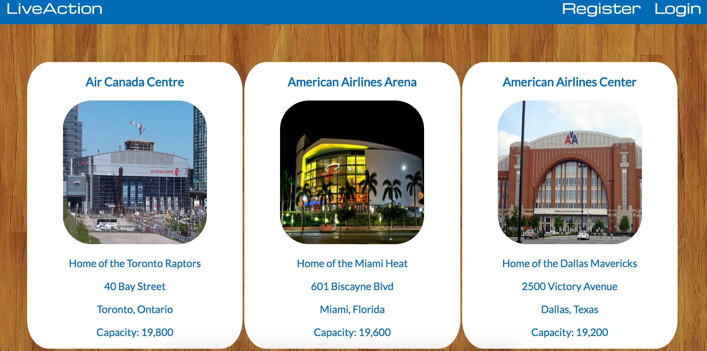

# LiveAction

## Description

A web application built using Ruby on Rails and styled with raw CSS. The app is hosted on Heroku and allows registered users to keep track of the NBA arenas that they have visited by checking in to a given arena. Users can also add/remove friends, like their friend's check-ins, and comment on a check-in.

Visit http://liveaction.herokuapp.com/ to check out the project.

## Screenshots

## Schema

