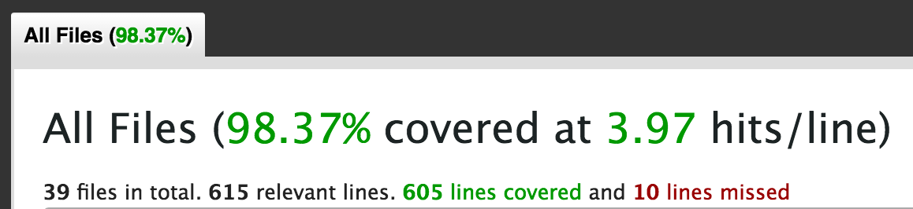

# LiveAction

## Description

A web application built using Ruby on Rails, tested with RSpec, and styled with raw CSS. The app is hosted on Heroku and allows registered users to keep track of the NBA arenas that they have visited by checking in to a given arena. Users can also add/remove friends, like their friend's check-ins, and comment on a check-in.

Visit http://liveaction.herokuapp.com/ to check out the project.

## Screenshots

## Test Coverage

The screen shot is up to date. If you would like to see the test coverage for a particular controller please follow the steps below:

1. Clone the repository to your local machine: <tt>git clone https://github.com/KlimekM/LiveAction.git</tt>
2. Install the dependencies <tt>bundle install/tt>
3. Run the tests <tt>be rspec</tt>
4. Open <tt>coverage/index.html</tt> in your browser.

## Schema

